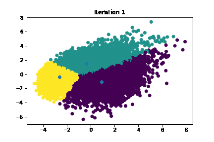

# K-Means from scratch
- This repo shows to implement the K-Means clustering algorithm from scratch using Python.
- The data used is FIFA 22 player ratings, available on [Kaggle](https://www.kaggle.com/datasets/stefanoleone992/fifa-22-complete-player-dataset).
- A plot visualization is also included to show the optimization process.
- To run the notebook, run `pip install -r requirements.txt` in the repo directory.

[Plot gif tutorial](https://towardsdatascience.com/basics-of-gifs-with-pythons-matplotlib-54dd544b6f30)
